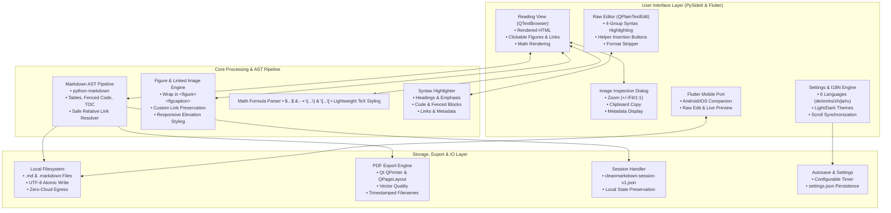
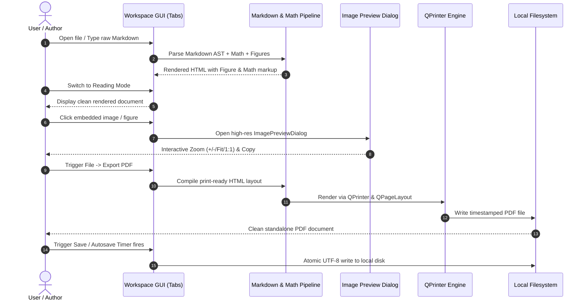

# CleanMarkdown

**English** · [Deutsch](README_DE.md)

> **Fast, distraction-free local Markdown viewer and editor with live reading mode, raw syntax-highlighted editor, high-resolution image inspection, math preview, timestamped PDF export, and 6-language UI (`de`, `en`, `es`, `zh`, `ja`, `ru`).**

[](https://github.com/doc-bricks)
[](https://github.com/open-bricks)
[](https://github.com/doc-bricks/CleanMarkdown/actions/workflows/tests.yml)
[](LICENSE)
[](https://python.org)
[](https://github.com/doc-bricks/CleanMarkdown)
[](SECURITY.md)
[](SECURITY.md)
[](tests)
[](CHANGELOG.md)
[](llms.txt)

> [!NOTE]
> Machine-readable project overview and AI context available in [`llms.txt`](llms.txt). Security policy and local privacy guarantees are documented in [`SECURITY.md`](SECURITY.md).

---

## Quick Navigation / Schnellnavigation

- [Features](#features)
- [Visual Showcase & Screenshots](#visual-showcase--screenshots)
- [Architecture & Pipeline](#architecture--pipeline)
- [Document & Export Lifecycle](#document--export-lifecycle)
- [Product Family & Workspace Matrix](#product-family--workspace-matrix)
- [Installation & Quickstart](#installation--quickstart)
- [Usage & Keyboard Shortcuts](#usage--keyboard-shortcuts)
- [Editor Syntax Highlighting](#editor-syntax-highlighting)
- [Local Privacy & Security](#local-privacy--security)
- [Sibling Tools & Document Ecosystem](#sibling-tools--document-ecosystem)
- [Development & Test Suite](#development--test-suite)
- [License & Support](#license--support)

---

## Features

- **Dual-Tab Workspace**: Instant switching between rendered `Reading` view and raw `Editor` with optional scroll synchronization.
- **Raw Markdown Editor**: Direct Markdown editing with convenient helper buttons for headings, tables, links, images, and task lists without WYSIWYG complexity.
- **Clear Formatting**: Strip Markdown syntax from selected text with a single click to start clean.
- **Interactive Image Inspection**: High-resolution `ImagePreviewDialog` with Zoom (+/- / Fit / 1:1), Clipboard Copying, and image metadata.
- **Figure & Linked Image Rendering**: Automatic wrapping of standalone images into `<figure>` and `<figcaption>` elements while fully preserving custom hyperlink targets.
- **Lightweight Math Preview**: Formula rendering for `$...$`, `$$...$$`, `\(...\)`, and `\[...\]` in reading mode and PDF exports without external TeX dependencies.
- **Vector PDF Export**: Clean, printable PDF generation with timestamp-based filenames.
- **Standardized Session Format**: Export and import `cleanmarkdown-session-v1.json` for seamless handoff to companion apps.
- **Autosave & Persistence**: Configurable autosave interval with atomic local file writes and safe settings management.
- **6-Language UI**: Full localization in German (`de`), English (`en`), Spanish (`es`), Chinese (`zh`), Japanese (`ja`), and Russian (`ru`).
- **Dark & Light Themes**: Calibrated color palettes with calm syntax highlighting.
- **Relative Asset Resolution**: Local image and document links automatically resolve relative to the active document folder.
- **Cross-Platform & Mobile Line**: Flutter mobile companion (`flutter_port/`) for Android and iOS with native offline file access.

---

## Visual Showcase & Screenshots

CleanMarkdown features a distraction-free interface designed for both comfortable long-form reading and precise raw Markdown editing:

| Reading Mode (Light Theme) | Reading Mode (Dark Theme) |
| :---: | :---: |
|  |  |
| *Rendered reading view with typography, math preview & figures* | *Eye-friendly dark reading mode with subtle contrast* |

| Raw Markdown Editor | Main Workspace Overview |
| :---: | :---: |
|  |  |
| *Restrained 4-group syntax highlighting & helper buttons* | *Full window layout with tab bar, toolbar & status* |

---

## Architecture & Pipeline

CleanMarkdown follows a clean separation between UI presentation, Markdown AST transformation, and local storage/export engines:



---

## Document & Export Lifecycle

The sequence diagram illustrates how documents are opened, edited, inspected, and exported:



---

## Product Family & Workspace Matrix

CleanMarkdown consists of aligned editions supporting local-first reading and writing across platforms:

| Feature / Workspace | 💻 Desktop App (PySide6) | 📱 Mobile Port (Flutter) |
| :--- | :--- | :--- |
| **Primary Platform** | Windows / Linux / macOS | Android / iOS |
| **Offline-Ready** | Yes (100% offline, zero-egress) | Yes (fully offline) |
| **File Access** | Direct Local Filesystem | Local Storage / Document Provider |
| **Export Options** | PDF Export, raw Markdown, Session JSON | Local Markdown file |
| **Autosave** | Configurable timer interval | Manual save flow |
| **Math Preview** | Yes (lightweight inline/block) | Yes (mobile-rendered) |
| **Image Inspection** | Interactive Zoom & Metadata Dialog | Mobile pinch-to-zoom |
| **Data Handoff** | Export/Import `cleanmarkdown-session-v1.json` | Standalone file transfer |

---

## Installation & Quickstart

### Requirements

- Python 3.10, 3.11, 3.12, or 3.13
- Dependencies listed in `requirements.txt` (`PySide6`, `markdown`)

### Steps

```powershell
python -m pip install -r requirements.txt
python main.py
```

Or start directly on Windows:

```bat
start.bat
```

---

## Usage & Keyboard Shortcuts

1. **Open & Create**: Open existing `.md`/`.markdown` files or `cleanmarkdown-session-v1.json` sessions from `File -> Open...` (`Ctrl+O`), or start typing in the editor.
2. **Tab Switching**: Switch between `Reading` and `Editor` tabs (`Ctrl+1` / `Ctrl+2` or tab bar).
3. **Format & Insert**: Use the editor toolbar helper buttons or shortcuts to insert headings, lists, tables, links, code blocks, or strip formatting.
4. **Image Inspection**: Click on any rendered image in reading view to open the interactive high-resolution viewer with Zoom and Clipboard copy.
5. **PDF Export**: Export the current document via `File -> Export PDF` (`Ctrl+Shift+P`) to generate a vector PDF.
6. **Session Handoff**: Save your complete session state via `File -> Export Session` for local transfer.
7. **Settings**: Configure language, theme, autosave interval, toolbar visibility, and scroll synchronization under `View -> Settings`.

Relative image links such as `` resolve against the active document's directory. Saving under a new location refreshes preview paths automatically.

---

## Editor Syntax Highlighting

The raw Markdown editor employs a restrained, eye-friendly 4-group color scheme:

- **Headings & Emphasis** (Blue): Structure markers (`#`, `##`) and bold/italic text.
- **Code & Fenced Blocks** (Green): Inline backticks and multi-line fenced code.
- **Links & Metadata** (Pink/Magenta): URLs, relative paths, image targets, and footnotes.
- **Structure & Markup** (Soft Gray-Violet): Lists, blockquotes, horizontal rules, and table delimiters.

---

## Local Privacy & Security

CleanMarkdown is built from the ground up on strict local-first and zero-cloud principles:

- **100% Offline (Zero-Egress)**: No cloud dependencies, no remote API calls, no analytics, and zero tracking.
- **Local File Boundaries**: File operations act strictly within the user-specified filesystem paths with traversal protections.
- **Non-Elevation**: Runs strictly in unprivileged user mode without requiring administrative rights.
- **Security Policy**: Complete reporting guidelines and contacts are documented in [`SECURITY.md`](SECURITY.md).

---

## Sibling Tools & Document Ecosystem

CleanMarkdown is part of the [`doc-bricks`](https://github.com/doc-bricks) document tooling suite and the broader [`open-bricks`](https://github.com/open-bricks) local-first open source ecosystem:

| Repository | Focus & Domain | Highlights |
| :--- | :--- | :--- |
| **[doc-bricks/CleanMarkdown](https://github.com/doc-bricks/CleanMarkdown)** | Fast local Markdown reader & editor | 6-Language UI, PDF export, math preview, zero-egress |
| **[doc-bricks/FormularErstellen](https://github.com/doc-bricks/FormularErstellen)** | Interactive AcroForm & fillable PDF builder | Visual form designer, schema validation, zero-cloud |
| **[doc-bricks/DokuZen](https://github.com/doc-bricks/DokuZen)** | Minimalist technical documentation viewer | Fast searchable offline documentation browser |
| **[doc-bricks/UniversalDocsGrabber](https://github.com/doc-bricks/UniversalDocsGrabber)** | Document & attachment aggregator | IMAP ingestion, SHA-256 deduplication, OCR export |
| **[doc-bricks/PDFtoPDFocr](https://github.com/doc-bricks/PDFtoPDFocr)** | Local PDF OCR & searchable text layer | 100% offline Tesseract OCR pipeline |
| **[file-bricks/WinStorePackager](https://github.com/file-bricks/WinStorePackager)** | MSIX packaging & Windows Store readiness | WACK validation, manifest generator, keyring storage |
| **[file-bricks/ExplorerPro](https://github.com/file-bricks/ExplorerPro)** | Modern multi-tab local file manager | Fast FTS5 search, batch actions, privacy-first |
| **[file-bricks/ProSync](https://github.com/file-bricks/ProSync)** | Bidirectional sync & SQLite WAL backup engine | Safe checkpointing, zero-egress, audit logs |
| **[dev-bricks/CodeBox](https://github.com/dev-bricks/CodeBox)** | Offline code snippet & developer notebook | Syntax highlighting, instant search, local storage |
| **[ellmos-ai/ellmos-filecommander-mcp](https://github.com/ellmos-ai/ellmos-filecommander-mcp)** | Model Context Protocol file operations | Safe agentic file tools with dry-run protection |
| **[open-bricks/open-bricks](https://github.com/open-bricks)** | Umbrella foundation for local-first desktop apps | Standardized quality, privacy & packaging guidelines |

---

## Development & Test Suite

```powershell
python -m pip install -r requirements.txt pytest ruff
python -m py_compile main.py translator.py
ruff check .
python -m pytest -q
python main.py --self-test
```

The test suite validates rendering accuracy, figure link preservation, math processing, session serialization, settings persistence, headless print isolation, and automated metadata contract synchronization (122 passed tests).

For the mobile line in `flutter_port/`, verified scope includes local `.md`/`.markdown` file opening, live rendering, raw editing, and local storage flows.

---

## License & Support

This project is licensed under the [MIT License](LICENSE).

For support, feature requests, or questions, please visit our [Issue Tracker](https://github.com/doc-bricks/CleanMarkdown/issues) or consult [`SUPPORT.md`](SUPPORT.md).
