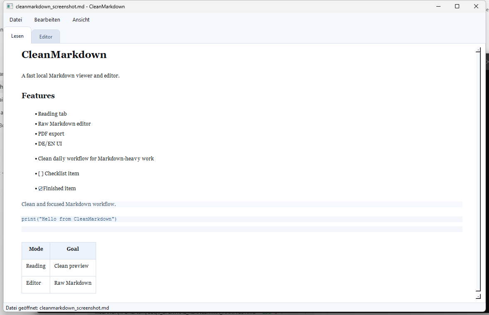

# CleanMarkdown

Schneller lokaler Markdown-Viewer und -Editor mit cleanem Lesemodus, Raw-Markdown-Bearbeitung, PDF-Export und DE/EN-Oberfläche.

[English README](README.md)

## Funktionen

- Zwei klare Tabs: `Lesen` und `Editor`
- Reiner Markdown-Editor mit Hilfsbuttons statt WYSIWYG-Komplexität
- Formatierung für markierten Text entfernen, um Markdown-Syntax zu lösen und frisch zu starten
- Cleane gerenderte Leseansicht
- PDF-Export mit Zeitstempel-Dateinamen
- Session-Export und -Import über `cleanmarkdown-session-v1.json` für den lokalen Übergang zum Web-Companion
- Autosave mit einstellbarem Intervall
- Deutsche und englische Oberfläche
- Helles und dunkles Theme
- Optionale obere Aktionsleiste für einen besonders ruhigen Standardaufbau
- Optionale Scroll-Synchronisierung beim Wechsel zwischen `Lesen` und `Editor`
- Leichtgewichtige Mathe-Vorschau für `$...$`, `$$...$$`, `\(...\)` und `\[...\]` in Leseansicht und PDF-Export
- Ruhige Syntaxhervorhebung für zentrale Markdown-Gruppen
- Relative Bilder und lokale Asset-Links werden aus dem Ordner der geöffneten Markdown-Datei geladen

## Screenshot



## Installation

### Voraussetzungen

- Windows mit Python 3.12+
- Pakete aus `requirements.txt`

### Schritte

```powershell
python -m pip install -r requirements.txt
python main.py
```

Oder direkt unter Windows:

```bat
start.bat
```

## Verwendung

1. Markdown-Datei oder `cleanmarkdown-session-v1.json` über `Datei -> Öffnen...` laden oder direkt im Editor schreiben.
2. Über die beiden Tabs zwischen `Lesen` und `Editor` wechseln.
3. Mit den Hilfsbuttons Markdown-Strukturen einfügen oder markieren und formatieren.
4. Das aktuelle Dokument über `Datei -> PDF exportieren` als PDF ausgeben oder den Arbeitsstand über `Datei -> Session exportieren` sichern.
5. Sprache, Theme, Autosave, Exportverhalten, Sichtbarkeit der Leisten und Scroll-Sync unter `Ansicht -> Einstellungen` anpassen.

Die Mathe-Unterstützung bleibt bewusst schlank: Formeln werden lokal lesbar und dezent dargestellt, ohne separate TeX-Laufzeit.

Relative Bildlinks wie `` werden relativ zum Speicherort der aktuellen Markdown-Datei aufgelöst. Nach `Speichern unter` aktualisiert sich die Vorschau, damit verschobene oder neu angelegte Asset-Verweise sofort den neuen Ordner nutzen.

Das Sessionformat transportiert bewusst keine Asset-Dateien. Für portables Markdown plus relative Bilder beschreibt [`EXPORTFORMAT.md`](EXPORTFORMAT.md) den reservierten Bundle-Vertrag, auch wenn der ZIP-Workflow noch nicht implementiert ist.

## Lokale Privatsphäre

CleanMarkdown öffnet und speichert Dateien lokal. Beim normalen Bearbeiten, Anzeigen und PDF-Export werden keine Dokumente in einen Cloud-Dienst hochgeladen.

## Editor-Hervorhebung

Der Raw-Editor nutzt eine reduzierte Vierer-Gruppierung:

- Blau für Überschriften und Hervorhebungen
- Grün für Inline-Code und Codeblöcke
- Pink/Magenta für Links, Bilder und Fußnoten
- Sanftes Grau-Violett für Listen, Zitate, Tabellen und Strukturmarker

## Projektstatus

Aktuelle Version: `0.3.1`

CleanMarkdown ist bereits als kleines öffentliches MVP nutzbar. Der aktuelle Schwerpunkt liegt auf praktischer Qualität bei realem Rendering und PDF-Export, nicht auf unnötigem Feature-Ausbau.

## Entwicklung

```powershell
python -m pip install -r requirements.txt pytest
python -m py_compile main.py
python -m pytest -q
python main.py --self-test
cd web_companion
npm ci
npm run build
python main.py
```

Der Selbsttest prüft Öffnen, Speichern/Export, Task-Listen, Mathe-Markup, Scroll-Sync, relative Asset-Auflösung und echte Markdown-Roundtrips über öffentliche Repo-Dokumente. Pytest deckt Renderer-, Formatierungs- und Datei-/Session-Randfälle ab. Der Web-Companion-Build validiert das PWA-TypeScript-Bundle.

## Lizenz

Dieses Projekt steht unter der [MIT-Lizenz](LICENSE).
