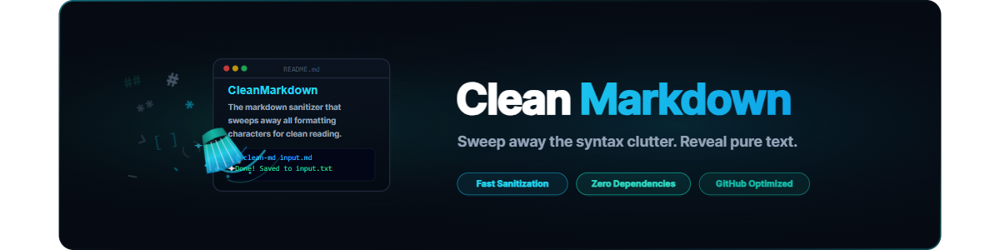
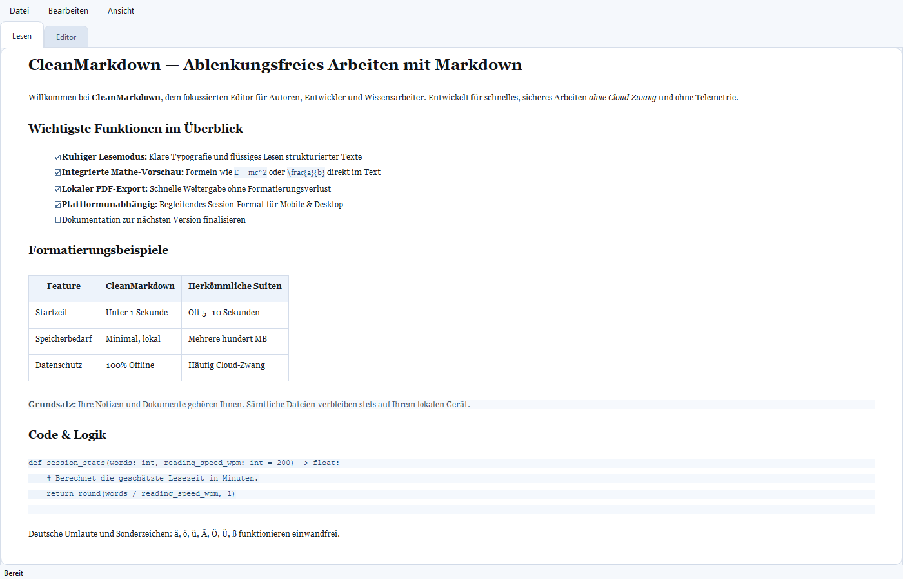
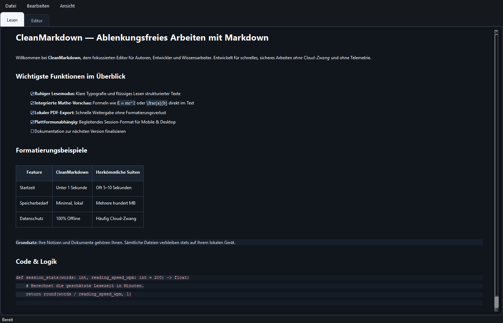
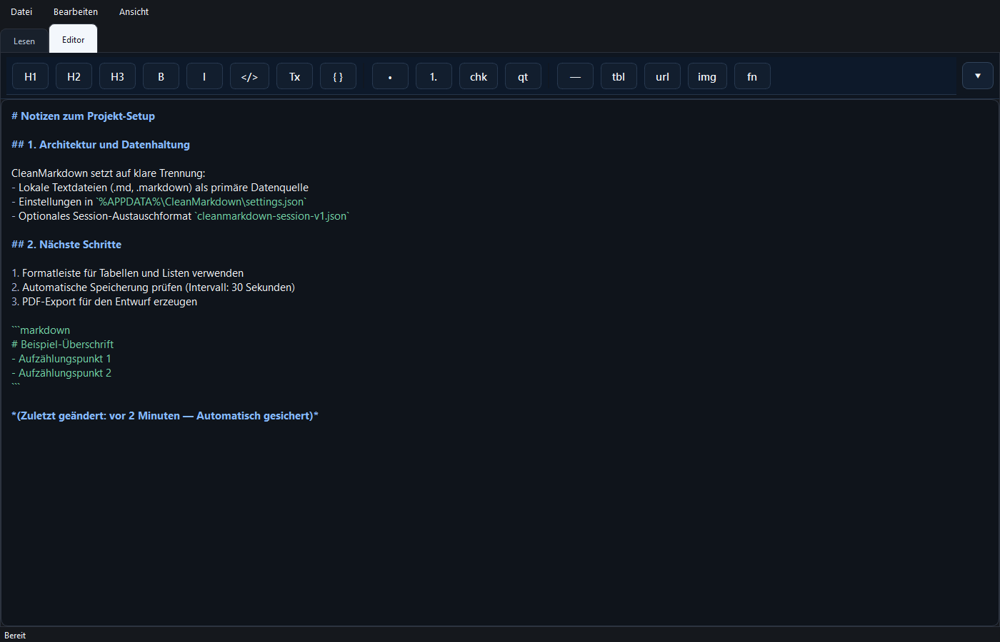
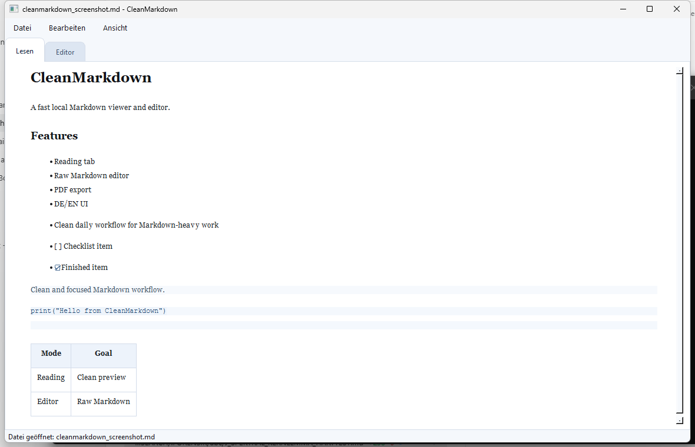
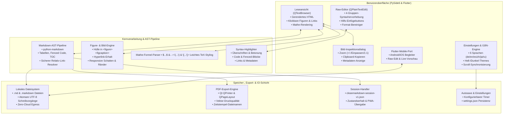
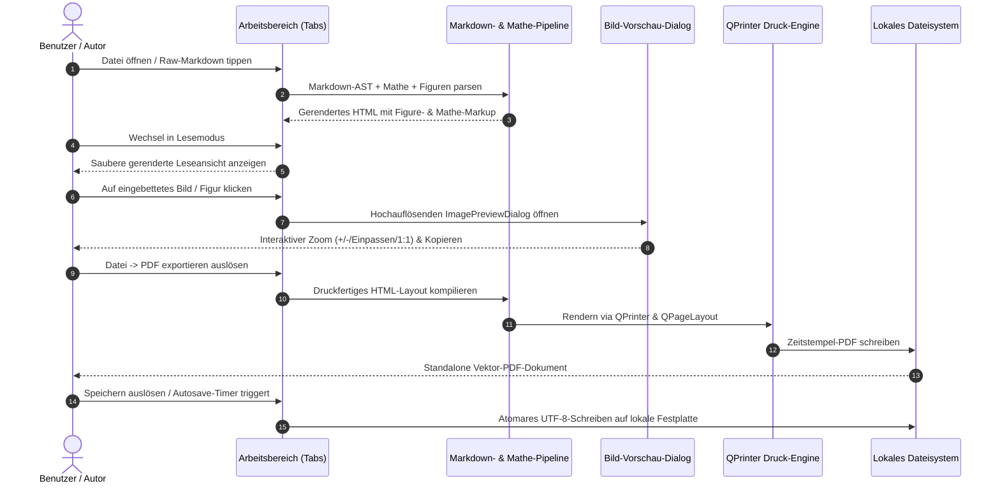

# CleanMarkdown

Deutsch · **[English](README.md)**

> **Schneller, ablenkungsfreier lokaler Markdown-Viewer und -Editor mit gerenderter Leseansicht, Raw-Syntaxhervorhebung, hochauflösender Bild-Inspektion, Mathe-Vorschau, PDF-Export mit Zeitstempel und 6-Sprachen-Oberfläche (`de`, `en`, `es`, `zh`, `ja`, `ru`).**

[](https://github.com/doc-bricks)
[](https://github.com/open-bricks)
[](https://github.com/doc-bricks/CleanMarkdown/actions/workflows/tests.yml)
[](LICENSE)
[](https://python.org)
[](https://github.com/doc-bricks/CleanMarkdown)
[](SECURITY.md)
[](SECURITY.md)
[](tests)
[](CHANGELOG.md)
[](llms.txt)

> [!NOTE]
> Maschinenlesbare Projektübersicht und KI-Kontext verfügbar in [`llms.txt`](llms.txt). Sicherheitsrichtlinie und lokale Datenschutzgarantien sind in [`SECURITY.md`](SECURITY.md) dokumentiert.

---

## Schnellnavigation / Quick Navigation

- [Funktionen](#funktionen)
- [Visuelle Galerie & Screenshots](#visuelle-galerie--screenshots)
- [Architektur & Pipeline](#architektur--pipeline)
- [Dokumenten- & Export-Lebenszyklus](#dokumenten--export-lebenszyklus)
- [Produktfamilie & Arbeitsbereich-Matrix](#produktfamilie--arbeitsbereich-matrix)
- [Installation & Schnelleinstieg](#installation--schnelleinstieg)
- [Verwendung & Tastenkombinationen](#verwendung--tastenkombinationen)
- [Editor-Syntaxhervorhebung](#editor-syntaxhervorhebung)
- [Lokale Privatsphäre & Sicherheit](#lokale-privatsphäre--sicherheit)
- [Geschwisterwerkzeuge & Dokumenten-Ökosystem](#geschwisterwerkzeuge--dokumenten-ökosystem)
- [Entwicklung & Testsuite](#entwicklung--testsuite)
- [Lizenz & Support](#lizenz--support)

---

## Funktionen

- **Zwei-Tab-Arbeitsbereich**: Nahtloser Wechsel zwischen gerenderter `Lesen`-Ansicht und `Editor` mit optionaler Scroll-Synchronisierung.
- **Reiner Markdown-Editor**: Direkte Bearbeitung von Markdown mit praktischen Hilfsbuttons für Überschriften, Tabellen, Links, Bilder und Aufgabenlisten ohne WYSIWYG-Komplexität.
- **Formatierung entfernen**: Markdown-Syntax markierter Textpassagen mit einem Klick auflösen und frisch beginnen.
- **Interaktive Bild-Inspektion**: Hochauflösender `ImagePreviewDialog` mit Zoom (+/- / Einpassen / 1:1), Zwischenablage-Kopieren und Bildmetadaten.
- **Figure- & Hyperlink-Rendering**: Automatisches Einbetten freistehender Bilder in `<figure>`- und `<figcaption>`-Elemente unter vollständiger Beibehaltung benutzerdefinierter Hyperlink-Ziele.
- **Leichtgewichtige Mathe-Vorschau**: Formeldarstellung für `$...$`, `$$...$$`, `\(...\)` und `\[...\]` in Leseansicht und PDF-Export ohne externe TeX-Laufzeitumgebung.
- **Vektor-PDF-Export**: Saubere, druckfertige PDF-Erstellung mit Zeitstempel-Dateinamen.
- **Standardisiertes Session-Format**: Export und Import über `cleanmarkdown-session-v1.json` für den reibungslosen Übergang zu Begleit-Apps.
- **Autosave & Persistenz**: Konfigurierbares Autosave-Intervall mit atomarem lokalen Dateisystemzugriff und sicherer Einstellungsverwaltung.
- **6-Sprachen-Oberfläche**: Vollständige Lokalisierung in Deutsch (`de`), Englisch (`en`), Spanisch (`es`), Chinesisch (`zh`), Japanisch (`ja`) und Russisch (`ru`).
- **Helles und dunkles Theme**: Abgestimmte Farbpaletten mit ruhiger Syntaxhervorhebung.
- **Relative Asset-Auflösung**: Lokale Bild- und Dokumentlinks werden automatisch relativ zum Ordner der aktiven Markdown-Datei aufgelöst.
- **Cross-Platform & Mobile Line**: Flutter-Mobile-Port (`flutter_port/`) für Android und iOS mit nativem Offline-Dateizugriff.

---

## Visuelle Galerie & Screenshots

CleanMarkdown bietet eine ruhige, ablenkungsfreie Benutzeroberfläche für komfortables Lesen und präzise Raw-Markdown-Bearbeitung:

| Lesemodus (Helles Theme) | Lesemodus (Dunkles Theme) |
| :---: | :---: |
|  |  |
| *Gerenderte Leseansicht mit Typografie, Mathe-Vorschau & Figuren* | *Augenschonender dunkler Lesemodus mit sanftem Kontrast* |

| Raw-Markdown-Editor | Hauptfenster-Übersicht |
| :---: | :---: |
|  |  |
| *Reduzierte 4-Gruppen-Syntaxhervorhebung & Hilfsbuttons* | *Vollständiges Layout mit Tab-Leiste, Toolbar & Status* |

---

## Architektur & Pipeline

CleanMarkdown trennt Benutzeroberfläche, Markdown-AST-Transformation und lokale Speicher-/Export-Engines modular:


```mermaid
flowchart TD
    subgraph UI ["Benutzeroberfläche (PySide6 & Flutter)"]
        A1["Leseansicht (QTextBrowser)<br/>• Gerendertes HTML<br/>• Klickbare Figuren & Links<br/>• Mathe-Rendering"]
        A2["Raw-Editor (QPlainTextEdit)<br/>• 4-Gruppen-Syntaxhervorhebung<br/>• Hilfs-Einfügebuttons<br/>• Format-Bereiniger"]
        A3["Bild-Inspektionsdialog<br/>• Zoom (+/-/Einpassen/1:1)<br/>• Clipboard-Kopieren<br/>• Metadaten-Anzeige"]
        A4["Einstellungen & I18N-Engine<br/>• 6 Sprachen (de/en/es/zh/ja/ru)<br/>• Hell-/Dunkel-Themes<br/>• Scroll-Synchronisierung"]
        A5["Flutter-Mobile-Port<br/>• Android/iOS Begleiter<br/>• Raw-Edit & Live-Vorschau"]
    end

    subgraph CORE ["Kernverarbeitung & AST-Pipeline"]
        B1["Markdown-AST-Pipeline<br/>• python-markdown<br/>• Tabellen, Fenced Code, TOC<br/>• Sicherer Relativ-Link-Resolver"]
        B2["Figure- & Bild-Engine<br/>• Hülle in &lt;figure&gt;&lt;figcaption&gt;<br/>• Hyperlink-Erhalt<br/>• Responsive Schatten & Ränder"]
        B3["Mathe-Formel-Parser<br/>• $...$ &amp; $$...$$<br/>• \\(...\\) &amp; \\[...\\]<br/>• Leichtes TeX-Styling"]
        B4["Syntax-Highlighter<br/>• Überschriften &amp; Betonung<br/>• Code &amp; Fenced-Blöcke<br/>• Links &amp; Metadaten"]
    end

    subgraph STORAGE ["Speicher-, Export- & IO-Schicht"]
        C1["Lokales Dateisystem<br/>• .md &amp; .markdown Dateien<br/>• Atomare UTF-8 Schreibvorgänge<br/>• Zero-Cloud Egress"]
        C2["PDF-Export-Engine<br/>• Qt QPrinter &amp; QPageLayout<br/>• Vektor-Druckqualität<br/>• Zeitstempel-Dateinamen"]
        C3["Session-Handler<br/>• cleanmarkdown-session-v1.json<br/>• Zustandserhalt &amp; PWA-Übergabe"]
        C4["Autosave & Einstellungen<br/>• Konfigurierbarer Timer<br/>• settings.json Persistenz"]
    end

    A1 <--> B1
    A2 <--> B4
    A1 <--> A3
    A1 <--> B2
    A1 <--> B3
    B1 --> C1
    B1 --> C2
    B1 --> C3
    A4 --> C4
    A5 <--> C1
```

---

## Dokumenten- & Export-Lebenszyklus

Das Sequenzdiagramm veranschaulicht das Laden, Bearbeiten, Inspizieren und Exportieren von Dokumenten:


```mermaid
sequenceDiagram
    autonumber
    actor User as Benutzer / Autor
    participant GUI as Arbeitsbereich (Tabs)
    participant AST as Markdown- & Mathe-Pipeline
    participant ImgDlg as Bild-Vorschau-Dialog
    participant PDF as QPrinter Druck-Engine
    participant FS as Lokales Dateisystem

    User->>GUI: Datei öffnen / Raw-Markdown tippen
    GUI->>AST: Markdown-AST + Mathe + Figuren parsen
    AST-->>GUI: Gerendertes HTML mit Figure- & Mathe-Markup
    User->>GUI: Wechsel in Lesemodus
    GUI-->>User: Saubere gerenderte Leseansicht anzeigen
    User->>GUI: Auf eingebettetes Bild / Figur klicken
    GUI->>ImgDlg: Hochauflösenden ImagePreviewDialog öffnen
    ImgDlg-->>User: Interaktiver Zoom (+/-/Einpassen/1:1) & Kopieren
    User->>GUI: Datei -> PDF exportieren auslösen
    GUI->>AST: Druckfertiges HTML-Layout kompilieren
    AST->>PDF: Rendern via QPrinter & QPageLayout
    PDF->>FS: Zeitstempel-PDF schreiben
    FS-->>User: Standalone Vektor-PDF-Dokument
    User->>GUI: Speichern auslösen / Autosave-Timer triggert
    GUI->>FS: Atomares UTF-8-Schreiben auf lokale Festplatte
```

---

## Produktfamilie & Arbeitsbereich-Matrix

CleanMarkdown besteht aus aufeinander abgestimmten Editionen für lokales Lesen und Schreiben auf allen Geräten:

| Feature / Arbeitsbereich | 💻 Desktop App (PySide6) | 🌐 Web Companion (PWA) | 📱 Mobile Port (Flutter) |
| :--- | :--- | :--- | :--- |
| **Primäre Plattform** | Windows / Linux / macOS | Web / Mobile Browser | Android / iOS |
| **Offline-Verfügbarkeit** | Ja (100% offline, Zero-Egress) | Ja (via Service Worker) | Ja (vollständig offline) |
| **Dateizugriff** | Direktes lokales Dateisystem | Drag & Drop / Dateidialog | Lokaler Speicher / Document Provider |
| **Exportoptionen** | PDF-Export, Raw-Markdown, Session-JSON | Raw-Markdown, Session-JSON | Lokale Markdown-Datei |
| **Autosave** | Konfigurierbares Intervall | Lokaler Browser-Speicher | Manueller Speicher-Workflow |
| **Mathe-Vorschau** | Ja (dezent inline/Block) | Ja (Browser-gerendert) | Ja (Mobile-gerendert) |
| **Bild-Inspektion** | Interaktiver Zoom- & Metadaten-Dialog | Nativer Browser-Viewer | Mobile Pinch-to-Zoom |
| **Daten-Übergabe** | Export/Import `cleanmarkdown-session-v1.json` | Export/Import `cleanmarkdown-session-v1.json` | Standalone Dateitransfer |

---

## Installation & Schnelleinstieg

### Voraussetzungen

- Python 3.10, 3.11, 3.12 oder 3.13
- Pakete aus `requirements.txt` (`PySide6`, `markdown`)

### Schritte

```powershell
python -m pip install -r requirements.txt
python main.py
```

Oder direkt unter Windows starten:

```bat
start.bat
```

---

## Verwendung & Tastenkombinationen

1. **Öffnen & Erstellen**: Vorhandene `.md`/`.markdown`-Dateien oder `cleanmarkdown-session-v1.json`-Sitzungen über `Datei -> Öffnen...` (`Strg+O`) laden oder direkt im Editor tippen.
2. **Tab-Wechsel**: Über die beiden Tabs zwischen `Lesen` und `Editor` umschalten (`Strg+1` / `Strg+2` oder Tab-Leiste).
3. **Formatieren & Einfügen**: Mit den Hilfsbuttons der Toolbar oder Tastenkombinationen Überschriften, Listen, Tabellen, Links, Codeblöcke einfügen oder Formatierungen entfernen.
4. **Bild-Inspektion**: Auf gerenderte Bilder im Lesemodus klicken, um die interaktive Großansicht mit Zoom und Zwischenablage-Kopieren zu öffnen.
5. **PDF-Export**: Das aktuelle Dokument über `Datei -> PDF exportieren` (`Strg+Umschalt+P`) als Vektor-PDF sichern.
6. **Session-Übergabe**: Den vollständigen Arbeitsstand über `Datei -> Session exportieren` für den lokalen Transfer sichern.
7. **Einstellungen**: Sprache, Theme, Autosave-Intervall, Leistensichtbarkeit und Scroll-Synchronisierung unter `Ansicht -> Einstellungen` festlegen.

Relative Bildlinks wie `` werden relativ zum Speicherort der aktuellen Markdown-Datei aufgelöst. Nach `Speichern unter` aktualisiert sich die Vorschau sofort auf das neue Verzeichnis.

---

## Editor-Syntaxhervorhebung

Der Raw-Editor nutzt ein reduziertes, augenschonendes 4-Gruppen-Farbschema:

- **Überschriften & Betonung** (Blau): Strukturmarker (`#`, `##`) und fett/kursiv formatierter Text.
- **Code & Fenced-Blöcke** (Grün): Inline-Backticks und mehrzeilige Code-Zäune.
- **Links & Metadaten** (Pink/Magenta): URLs, relative Pfade, Bildziele und Fußnoten.
- **Struktur & Markup** (Sanftes Grau-Violett): Listen, Blockzitate, Trennlinien und Tabellenbegrenzer.

---

## Lokale Privatsphäre & Sicherheit

CleanMarkdown basiert auf strikten Local-First- und Zero-Cloud-Prinzipien:

- **100% Offline (Zero-Egress)**: Keine Cloud-Abhängigkeiten, keine Remote-API-Aufrufe, keine Telemetrie und keinerlei Tracking.
- **Lokale Dateigrenzen**: Dateioperationen agieren ausschließlich innerhalb der vom Nutzer gewählten Dateipfade mit Pfad-Traversal-Schutz.
- **Non-Elevation**: Läuft vollständig im unprivilegierten Benutzer-Modus ohne Administratorrechte.
- **Sicherheitsrichtlinie**: Richtlinien zur Schwachstellenmeldung und Kontakte sind in [`SECURITY.md`](SECURITY.md) hinterlegt.

---

## Geschwisterwerkzeuge & Dokumenten-Ökosystem

CleanMarkdown ist Teil der [`doc-bricks`](https://github.com/doc-bricks) Dokumenten-Werkzeugsuite und des übergeordneten [`open-bricks`](https://github.com/open-bricks) Local-First Open-Source-Ökosystems:

| Repository | Schwerpunkt & Domäne | Highlights |
| :--- | :--- | :--- |
| **[doc-bricks/CleanMarkdown](https://github.com/doc-bricks/CleanMarkdown)** | Schneller lokaler Markdown-Viewer & -Editor | 6-Sprachen-UI, PDF-Export, Mathe-Vorschau, Zero-Egress |
| **[doc-bricks/FormularErstellen](https://github.com/doc-bricks/FormularErstellen)** | Visueller AcroForm- & PDF-Formular-Builder | Interaktiver Formular-Editor, Schema-Prüfung, Zero-Cloud |
| **[doc-bricks/DokuZen](https://github.com/doc-bricks/DokuZen)** | Minimalistischer Betrachter technischer Dokumentationen | Schneller durchsuchbarer Offline-Dokumenten-Browser |
| **[doc-bricks/UniversalDocsGrabber](https://github.com/doc-bricks/UniversalDocsGrabber)** | Dokumenten- & Anhangs-Aggregator | IMAP-Abruf, SHA-256-Deduplizierung, OCR-Export |
| **[doc-bricks/PDFtoPDFocr](https://github.com/doc-bricks/PDFtoPDFocr)** | Lokales PDF-OCR & durchsuchbare Textebene | 100% Offline-Tesseract-OCR-Pipeline |
| **[file-bricks/WinStorePackager](https://github.com/file-bricks/WinStorePackager)** | MSIX-Paketierung & Windows-Store-Bereitschaft | WACK-Validierung, Manifest-Generator, Keyring-Schutz |
| **[file-bricks/ExplorerPro](https://github.com/file-bricks/ExplorerPro)** | Moderner Multi-Tab-Dateimanager | Schnelle FTS5-Suche, Batch-Aktionen, Privacy-First |
| **[file-bricks/ProSync](https://github.com/file-bricks/ProSync)** | Bidirektionale Synchronisation & SQLite-WAL-Backups | Sichere Checkpoints, Zero-Egress, Audit-Logs |
| **[dev-bricks/CodeBox](https://github.com/dev-bricks/CodeBox)** | Lokales Code-Snippet- & Notizbuch-Tool | Syntax-Highlighting, Sofortsuche, lokaler Speicher |
| **[ellmos-ai/ellmos-filecommander-mcp](https://github.com/ellmos-ai/ellmos-filecommander-mcp)** | Model Context Protocol Dateisystem-Werkzeuge | Sichere Agenten-Tools mit Dry-Run-Absicherung |
| **[open-bricks/open-bricks](https://github.com/open-bricks)** | Dachorganisation für Local-First Desktop-Anwendungen | Standardisierte Qualitäts-, Datenschutz- & Paketierungs-Richtlinien |

---

## Entwicklung & Testsuite

```powershell
python -m pip install -r requirements.txt pytest ruff
python -m py_compile main.py translator.py
ruff check .
python -m pytest -q
python main.py --self-test
```

Die Testsuite validiert Rendering-Genauigkeit, Hyperlink-Erhalt bei Figuren, Mathe-Verarbeitung, Session-Serialisierung, Headless-Druckisolation und automatisierte Metadaten-Vertragssynchronisation (105 bestandene Tests).

Für den mobilen Zweig in `flutter_port/` umfasst der geprüfte Umfang das Öffnen lokaler `.md`/`.markdown`-Dateien, Live-Rendering, Raw-Editing und lokale Speicher-Abläufe.

---

## Lizenz & Support

Dieses Projekt steht unter der [MIT-Lizenz](LICENSE).

Für Fragen, Feedback und Problemmeldungen nutze bitte den [Issue Tracker](https://github.com/doc-bricks/CleanMarkdown/issues) oder lies [`SUPPORT.md`](SUPPORT.md).
